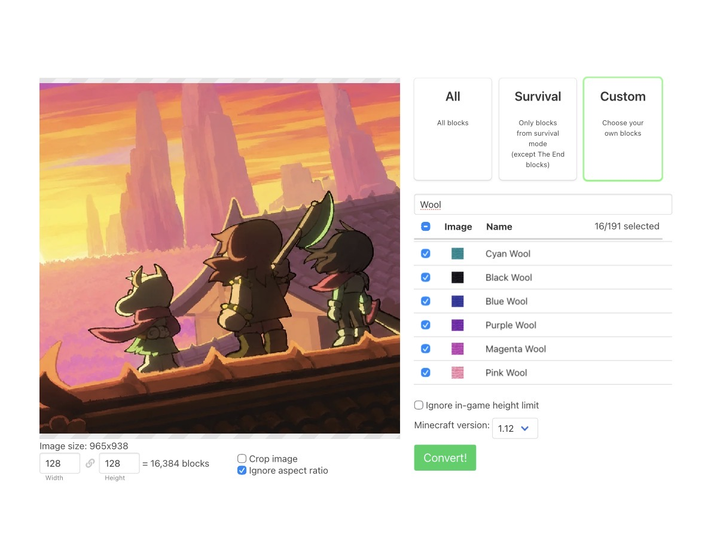

# Guía de creación de mapas de Mc en base a imágenes

## 1. convierte la imagen a bloques de mc

### Importante

para nuestra versión y mayor comodidad estos son los datos, así se verá la interfaz una vez insertados los datos:

|    Datos    |   Valor   |
|-------------|-----------|
|   Bloques   |   lanas   |
| Dimensiones | 128 x 128 |

[Entra aquí e inserta los datos necesarios](https://minecraft.netlify.app)

## 2. convertir la imagen al mapa

[Entra aquí y carga la imagen](https://miguelgomez75.github.io/TratadodeImagenestest/)

Luego descárgala como csv e impórtala en un tablero libre de la [hoja de cálculo](https://docs.google.com/spreadsheets/d/1RpZDyDtO-YxbaUWvKMpOnLGS0H4wV0Ou5jcnVqgSbXU/edit?gid=1846272196#gid=1846272196)

## 3. Construir el mapa

En la hoja de cálculo, en la hoja "Guía de Construcción", se marcará un tablero, ese tablero es el que se construirá.

Entra en una de las hojas "Guía de construcción (x)", en ellas hay un selector de chunks (pedazos de tablero).
Una vez seleccionado uno, ese será el chunk que estarás construyendo, utiliza las alfombras de lana para recrear el chunk en la posición correcta.
